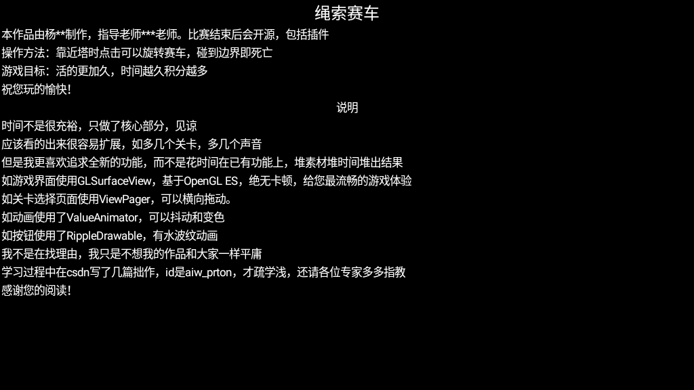
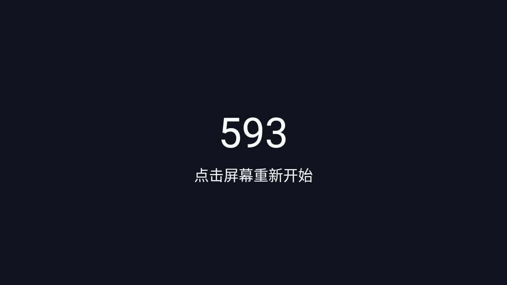

# car项目

这个就是我上传提交的项目，没得奖，看来我还需努力

额就是个绳索赛车的简化简化简化简化版，玩法摸索几下就行了，度娘一下就知道我抄的哪个游戏

删除掉部分个人信息，用***代替

关卡部分用的是json加载，大家可以改着玩

补充了测试图

## 测试图

## 有很多bug

app inventor的退出是硬伤，反复退出好几次才行，没空优化了

OpenGL的兼容性也不大好

由于做的第一个页面是游戏的play画面，没空重构就只得硬跳转了

## 说明部分

额，app里的说明真的没有对这个世界有什么偏见

当时快来不及了忙的手忙脚乱，眼看做不完了就把自己好好的夸一番，嗯，就这样

相信大家也有完不成的经历吧，那时真的急坏了

关卡一个是1-1，另一个就是1-4，真的不是我数数不好，是没空写中间两个了

我就原模原样的放着吧，现在看起来也挺尬的，但还是放着吧，不删了
